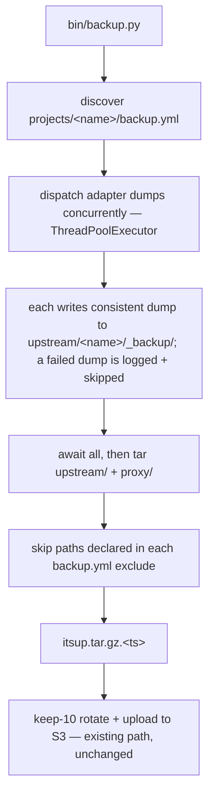
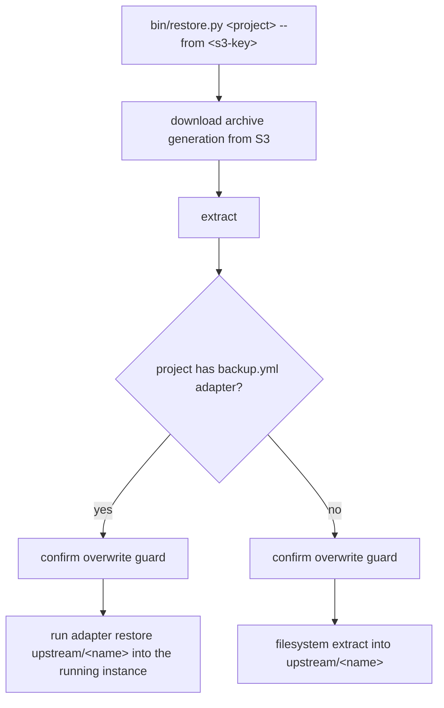

# Backup & Restore — Design

## Purpose

itsUP backs up host state by tarring `upstream/` (and `proxy/`) and uploading a
single timestamped archive to S3 with keep-10 rotation (`bin/backup.py`). That
archive is crash-inconsistent for live stores — a database's data directory
copied while the engine is writing cannot be safely restored — and there is no
restore path at all.

This design closes both gaps with one mechanism: a **per-project adapter** that
produces a *consistent logical dump next to its data in the archive tree*, so the
existing monolithic tar sweeps the dump up and ships it unchanged. Adapters never
touch S3 — the mother script owns shipping. The same adapter supplies the inverse
`restore`, loading the dump back **into the running instance**. A store that
declares an adapter is automatically excluded from the live-tar at its declared
paths, so its torn data directory is never archived while its consistent dump is.

The framework is the deliverable; Postgres is the first adapter that proves the
round trip. New stateful stores plug in by authoring an adapter pair plus a
`backup.yml` — with no change to the framework.

## Inputs/Outputs

**Inputs**

- `projects/<name>/backup.yml` — the per-project registry entry. Travels with the
  project (not the infra config), decoupled from the ephemeral `upstream/`:
  - `adapter: <name>` — optional; the adapter that backs this project. When set,
    resolved from the project's own dir first (`projects/<name>/backup-adapter.sh`)
    and otherwise from the shared set (`bin/backup-adapters/<name>.sh`), so a new
    store can be fully self-contained with no change to the framework. Omitted for
    an **ephemeral store** (e.g. redis): a `backup.yml` carrying only `exclude` and
    no `adapter` drops those paths from the live-tar without producing a dump.
  - `exclude: [<path>...]` — live-state paths under the project's archive dir to
    keep out of the monolithic tar (e.g. `data`), so the torn live directory is
    skipped while the adapter dump is included.
- The **running container** for an adapter-backed project, reached via the
  existing compose-exec pattern with `get_env_with_secrets(project)` from
  `lib.data`.
- `upstream/<name>/` — the project's archive dir (where `./data` materializes;
  see `project/design/deployment-orchestration`), and the dump's destination.
- `proxy/` — Traefik config + `acme.json` certificates, added to the monolithic
  archive.
- S3 credentials (`AWS_ACCESS_KEY_ID`, `AWS_SECRET_ACCESS_KEY`, `AWS_S3_HOST`,
  `AWS_S3_REGION`, `AWS_S3_BUCKET`) loaded from the infra secrets via
  `load_secrets()` — the existing boto3 access pattern, reused unchanged.

**Outputs**

- One timestamped archive `itsup.tar.gz.<timestamp>` in the S3 bucket, retained
  at the last 10 versions. The archive now contains, per adapter-backed project,
  the consistent dump under `upstream/<name>/_backup/` and excludes that
  project's declared live paths; it also contains `proxy/` state.
- On restore, a recovered **running instance** for adapter-backed projects, and a
  filesystem extract for non-adapter projects.

## Invariants

- **Adapters never touch S3.** `dump` writes a local file; `restore` reads a local
  file. The mother script (`bin/backup.py`) is the sole owner of archiving and
  upload, and `bin/restore.py` is the sole owner of download and extraction. The
  existing rotate+upload path is reused unchanged — never duplicated per adapter.
- **One archive, one retention.** Dumps ride inside the single monolithic
  `itsup.tar.gz.<timestamp>`; retention is the existing keep-10 rotation on that
  archive. There is no separate per-adapter S3 object and no PITR.
- **Derived exclusion.** The live-tar exclusion set is derived from the presence
  of `projects/<name>/backup.yml` and its `exclude` paths — there is no separately
  maintained exclude list. A project with an adapter is never both adapter-dumped
  and live-tarred at the same paths.
- **Database restore is logical, into the running instance.** An adapter restore
  loads the dump into the live engine; it never drops a filesystem snapshot into a
  data directory. This distinction is the correctness fix.
- **Restore is guarded, unconditionally.** Restore prompts the operator before
  any write — it does **not** try to detect whether data already exists (that is
  error-prone for a containerized store); it always asks, with a `-y`/`--yes`
  bypass for non-interactive use. Restore is a bare dispatcher (`bin/restore.py`),
  not an `itsup` subcommand.
- **Dumps run concurrently, before the tar.** The mother script dispatches the
  independent per-project adapter dumps in parallel (a `ThreadPoolExecutor` over
  subprocesses — they share no state, each writing only its own
  `upstream/<name>/_backup/`), and awaits all of them before it begins the tar,
  so the archive captures the just-written consistent dumps.
- **Partial availability over total failure.** A single adapter dump that fails
  (e.g. its container is down) is logged and skipped — it never aborts the run.
  The mother script still tars and uploads every healthy project plus `proxy/`
  state. One sick store does not deny backup to the rest of the host.

## Primary flows

### Backup

### Restore

`bin/restore.py` accepts a single project name, `all` for the whole stack, or the
special target `proxy` (`bin/restore.py proxy --from <key>`) which extracts the
archived `proxy/` state. Proxy is an infra stack, not a project, so it has its own
restore target rather than being addressed as a project.

### Adapter contract

An adapter is `bin/backup-adapters/<name>.sh` exposing two verbs, each receiving
the project's archive dir:

- `dump <project-upstream-dir>` — write a consistent dump under
  `<project-upstream-dir>/_backup/`. No S3.
- `restore <project-upstream-dir>` — load that dump into the running instance. No
  S3.

The **Postgres** adapter: `dump` runs `pg_dumpall --globals-only` (roles) plus a
per-database `pg_dump -Fc`, executed through the compose-exec pattern, into
`upstream/postgres/_backup/`. `restore` establishes roles/globals first, then
`pg_restore`/`psql` each database into the running instance. `projects/postgres/`
declares `adapter: postgres` and `exclude: [data]`.

## Failure modes

- **Instance unreachable at dump/restore time.** Adapter operations run against
  the live container. On dump, a failure (container down, exec error) is logged
  and that one project is skipped; the mother script continues with every other
  project and `proxy/` state (partial availability). On restore, a failure aborts
  that project's restore and is reported — restore is operator-driven and
  targeted, so it fails closed rather than continuing.
- **Restore order dependency.** A per-database restore before roles/globals exist
  fails on missing roles. The Postgres adapter sequences globals first; this
  ordering is part of the adapter contract for any role-bearing store.
- **Destructive overwrite.** Restore overwriting a running service's data is
  guarded by an unconditional confirmation prompt before any write (bypassable
  only via an explicit `-y`/`--yes` flag for automation), rather than trying to
  detect whether data already exists.
- **Exclusion derivation error.** If derivation wrongly includes an
  adapter-managed live path, the archive carries both a torn directory and the
  dump (wasteful, and the torn copy is misleading); if it wrongly drops a
  non-adapter project, that project is lost. Derivation is driven solely by the
  presence and `exclude` paths of `backup.yml`.
- **Double compression.** A `pg_dump -Fc` (already compressed) re-compressed by the
  gzip tar yields little extra and costs CPU; it is harmless and accepted, not
  specially cased.

## See Also

- docs/project/design/deployment-orchestration.md
- docs/project/design/network-segmentation.md
