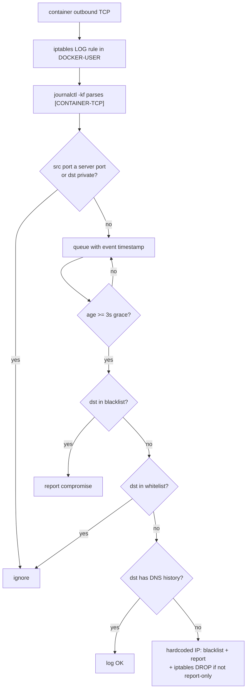

# Container Security Monitor — Design

## Purpose

The monitor detects a compromised container that connects outbound to a
**hardcoded IP** — an IP it never resolved through DNS, the signature of malware
talking to C2 infrastructure. The premise: legitimate services resolve a domain
before connecting, so a container's outbound TCP destination should always have
prior DNS history. A destination with no DNS history is flagged as a hardcoded IP
and (in blocking modes) dropped.

It runs as a **host Python process**, not a container (itsUP's own code is never
containerized). The entry point is `bin/monitor.py`, which constructs
`monitor.core.ContainerMonitor` and calls `.run()`. It requires root
(`os.geteuid() != 0` exits) because it reads kernel logs and writes iptables
rules. `monitor/README.md`, `docs/operations/monitoring.md`, and `docs/security.md`
record the incident history that motivated it.

## Inputs/Outputs

**Inputs**

- **dnsmasq honeypot logs** — `docker logs -f dns-honeypot`, parsed for
  `reply|cached <domain> is <ipv4>` lines to build the IP→domains DNS cache
  (`monitor/core.py:monitor_honeypot`, regex at `core.py:472`). IPv6 (`::`) is
  skipped.
- **Kernel TCP connection logs** — `journalctl -kf` lines prefixed
  `[CONTAINER-TCP]`, parsed for `SRC/DST/SPT/DPT`
  (`core.py:monitor_direct_connections`, pattern at `core.py:514`). These exist
  because the monitor inserts an iptables LOG rule (below).
- **Docker** — `docker ps` / `docker inspect` for container IP→name mapping
  (`core.py:update_container_mapping`) and `docker events` for live
  start/stop updates (`core.py:monitor_docker_events`).
- **Persistent DNS registry** — `data/dns-registry.json`, loaded on startup so
  DNS history survives restarts; bootstrapped from 48h of honeypot logs on first
  run (`core.py:_load_dns_registry`, `DNS_CACHE_WINDOW_HOURS = 48` in
  `monitor/constants.py:30`).
- **IP lists** — whitelist `data/whitelist/whitelist-outbound-ips.txt` and
  blacklist `data/blacklist/blacklist-outbound-ips.txt`, one IPv4 per line with
  optional `# comment` (`monitor/constants.py:19-20`; `monitor.lists.IPList`).
- **OpenSnitch DB** (optional, `--use-opensnitch`) —
  `/var/lib/opensnitch/opensnitch.sqlite3`, **SELECT-only** (`monitor/opensnitch.py`).

**Outputs**

- **Blacklist file** — detected hardcoded IPs appended
  (`core.py:add_to_blacklist`).
- **iptables DROP rules** — inserted in chain `DOCKER-USER` for blacklisted IPs
  in blocking modes (`monitor/iptables.py:add_drop_rule`,
  `IPTABLES_CHAIN = "DOCKER-USER"` in `constants.py:45`).
- **iptables LOG rule** — one rule logging NEW outbound container TCP, the source
  of the `[CONTAINER-TCP]` kernel lines (`iptables.py:ensure_log_rule_exists`).
- **Log file** — `logs/monitor.log` (`constants.py:17`).
- **Threat-actor CSV** — `reports/potential_threat_actors.csv`, produced by the
  separate `bin/analyze_threats.py` (reverse-DNS, RDAP whois, optional AbuseIPDB
  enrichment of blacklist IPs), invoked via `itsup monitor report`.

**Governing code**

- Orchestration & detection: `monitor/core.py:ContainerMonitor`.
- iptables: `monitor/iptables.py:IptablesManager`.
- OpenSnitch reads: `monitor/opensnitch.py:OpenSnitchIntegration`.
- Entry / cleanup / clear-iptables: `bin/monitor.py`.
- CLI: `commands/monitor.py` (`itsup monitor start|stop|logs|cleanup|clear-iptables|report`).
- Constants: `monitor/constants.py`.

## Invariants

1. **No DNS history ⇒ hardcoded IP.** A non-private destination IP absent from
   the DNS cache is treated as malware-indicative and handled
   (`core.py:check_direct_connections`, `core.py:_handle_hardcoded_ip_detection`).
2. **Whitelist outranks blacklist.** `add_to_blacklist` returns early for a
   whitelisted IP; a newly whitelisted IP is removed from the blacklist and its
   DROP rule cleared on list reload (`core.py:add_to_blacklist`,
   `core.py:check_list_updates`).
3. **Private IPs are never flagged.** RFC-1918, loopback, and link-local
   destinations are skipped before detection (`core.py:is_private_ip`,
   `monitor_direct_connections` private-IP guard, `constants.py:PRIVATE_IP_RANGES`).
4. **Blocking is mode-gated.** iptables DROP only happens when
   `report_only` is false; report-only still detects, blacklists (in-file), and
   logs (`core.py:add_to_blacklist` final guard).
5. **iptables rules persist past monitor exit.** Shutdown leaves DROP and LOG
   rules in place; removal is explicit via `itsup monitor clear-iptables`
   (`core.py:_cleanup_and_exit`, `bin/monitor.py:clear_iptables_rules`).
6. **DNS history is trusted indefinitely within the registry.** Once an IP has
   any cached domain it is treated as legitimate; there is no expiry
   (`core.py` DNS cache; `_load_dns_registry` re-seeds it on restart).
7. **A 3-second grace period precedes each connection check** so DNS logs can
   arrive first; age is measured from the kernel-log event timestamp, not stream
   arrival (`CONNECTION_GRACE_PERIOD = 3.0` in `constants.py:32`;
   `core.py:check_direct_connections`).
8. **OpenSnitch access is read-only and confined to one rule.** Queries SELECT
   `rule = '0-deny-arpa-53'` rows; the DB is never written
   (`monitor/opensnitch.py`). See `project/policy/opensnitch-database`.

## Primary flows

### Run modes

Selected by flags on `bin/monitor.py` / `itsup monitor start`
(`bin/monitor.py:main`, `commands/monitor.py:start`):

- **Report-only** (`--report-only`) — detect, blacklist in-file, log; **no**
  iptables DROP. This is the mode `itsup run` starts the monitor in
  (`commands/run.py:93` passes `--report-only`).
- **Protection** (default, no flags) — detect plus insert iptables DROP rules.
- **OpenSnitch cross-reference** (`--use-opensnitch`) — adds a thread that reads
  OpenSnitch's `0-deny-arpa-53` blocks and annotates blacklist entries as
  `CONFIRMED by OpenSnitch` or `needs review`; composes with either mode above.
  Requires the DB to exist or startup exits (`bin/monitor.py:241`).

`--skip-sync` runs memory-only (no file I/O). `--cleanup` and `--clear-iptables`
are one-shot subcommands that run and exit.

### Detection pipeline (real-time)

In parallel, `monitor_honeypot` continuously updates the DNS cache from dnsmasq
replies and persists new entries to `data/dns-registry.json`.

### Startup sequence (`core.py:run`)

1. Map containers (`update_container_mapping`) and ensure the iptables LOG rule
   exists (`_setup_iptables`).
2. If `--use-opensnitch`, load historical `0-deny-arpa-53` blocks for
   cross-reference (`_load_opensnitch_blocks`).
3. Historical scan: parse `journalctl -k` since the last processed timestamp
   (read from `logs/monitor.log`) and flag any past hardcoded IPs
   (`collect_historical_data`, `_detect_hardcoded_ips`).
4. Start daemon threads: docker events, honeypot, direct-connection capture,
   connection checker, periodic tasks (every 5s: list reload + container
   remap) — plus the OpenSnitch thread when enabled
   (`_start_monitoring_threads`).

### Manual list management

Operators edit the whitelist/blacklist files directly; `periodic_tasks` reloads
them every 5s (`PERIODIC_TASK_INTERVAL = 5`), syncing iptables for added/removed
IPs (`check_list_updates`). `itsup monitor cleanup` (`bin/monitor.py:cleanup_blacklist`)
reviews the blacklist for false positives — primary source OpenSnitch
`0-deny-arpa-53` blocks, fallback dnsmasq DNS history — and interactively moves
unconfirmed IPs to the whitelist.

## Failure modes

- **DNS log lag flags a legitimate IP.** If a connection is checked before its
  DNS reply is cached, a legitimate destination looks hardcoded. The 3s grace
  period and the persistent registry mitigate this; residual false positives are
  resolved via `itsup monitor cleanup` or by whitelisting
  (`core.py:check_direct_connections`).
- **Honeypot container absent.** `monitor_honeypot` / `_parse_dns_logs` shell out
  to `docker logs dns-honeypot`; if the `dns-honeypot` container
  (`HONEYPOT_CONTAINER` in `constants.py:24`) is not running the DNS cache stays
  empty and every non-whitelisted outbound IP is flagged. Ensure the DNS stack is
  up (`itsup dns up` / `itsup run`).
- **iptables rules outlive the monitor.** Stopping the monitor does not remove
  DROP rules; a stale blacklist keeps IPs blocked until
  `itsup monitor clear-iptables` (`iptables.py:clear_monitor_rules`).
- **`--use-opensnitch` without the DB.** Startup exits with an error if
  `/var/lib/opensnitch/opensnitch.sqlite3` is missing (`bin/monitor.py:241`).
- **VPN containers self-exclude.** Containers whose name starts with
  `vpn-vpn-openvpn-` are skipped from detection by a hardcoded guard
  (`core.py:_handle_hardcoded_ip_detection`), since their hardcoded-IP behavior is
  expected.
- **IPv6 / UDP / host-networked traffic is invisible.** Only IPv4 TCP from the
  Docker `172.0.0.0/8` range is monitored (`constants.py:DOCKER_NETWORK_CIDR`,
  IPv6 skip in honeypot and connection parsing); other traffic is not detected.

## See Also

- docs/project/design/security-architecture.md
- docs/project/policy/opensnitch-database.md
