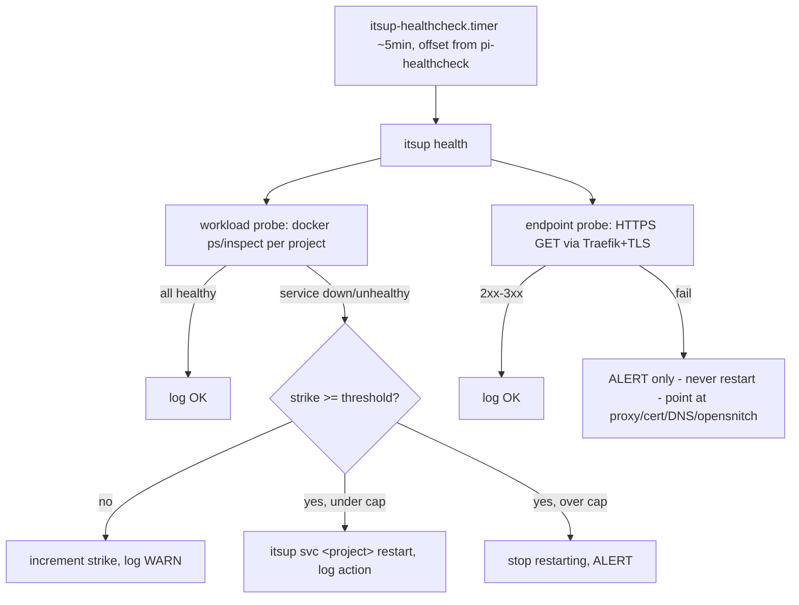

# Health Check Automation — Design

> **Status: target.** This snippet specifies intended state. It is the design of
> record for delivery slug `health-check-automation`; no code exists yet. It flips
> to `actual` when that slug delivers.

## Purpose

Close the monitoring gap that sits **above** host vitals. `bin/pi-healthcheck.sh`
(systemd `pi-healthcheck.timer`, every 5 min) covers the **host layer** — memory,
load, conntrack, disk, docker-daemon liveness — and remediates bluntly with a strike
counter: restart docker + `itsup dns/proxy up`, then reboot. Two layers above it have
**no automation today**:

- **Workload health** — is each project's container running and (if it declares a
  healthcheck) healthy? Probe exists: `bin/workload-healthcheck.py`.
- **Endpoint reachability** — does each project's public HTTPS endpoint answer through
  Traefik + TLS, from outside? Probe exists: `bin/check-endpoints.py`.

Both probes are currently **untracked, undocumented, and invoked by nothing**. This
design promotes them into a first-class, discoverable, tested platform capability so
they can never become orphaned background scripts, and applies remediation matched to
each layer rather than one blunt host-level hammer.

## Inputs/Outputs

**Inputs**
- Project set from `list_projects()` and each project's `itsup-project.yml` ingress +
  `docker-compose.yml` healthchecks.
- Workload probe: `docker ps`/`docker inspect` filtered by compose project+service
  labels → per-service `running` / `health` state.
- Endpoint probe: HTTPS GET to each HTTPS-eligible ingress, path inferred from the
  service's healthcheck `test` URL (falling back to `path_prefix`, then `/`); 2xx–3xx = OK.

**Outputs**
- `itsup health` — human-facing report + exit code (0 healthy, 1 failures, 2 error).
- Workload remediation: targeted `itsup svc <project> restart`, strike-gated.
- Endpoint findings: **alert only** (loud log line), never a restart.
- Logs to the existing fleet path family (`/var/log/instrukt-ai/itsup/…`) and the
  systemd journal via the unit — the same surfaces operators already watch.

## Invariants

1. **Endpoint failures never trigger workload restarts.** An "endpoint unreachable +
   workload healthy" state is the signature of an infra fault — cert/DNS/proxy, or the
   OpenSnitch loopback wedge (see `docs/project/design/security-architecture.md`). Auto-restarting workloads
   there churns pointlessly and *masks* the real cause. Endpoint failure = alert,
   escalate to a human.
2. **Workload remediation is targeted and strike-guarded.** Restart only the failing
   project (`itsup svc <project> restart`), only after N consecutive misses, and stop
   restarting + alert after a cap — mirroring `pi-healthcheck.sh`'s strike pattern so a
   crash-looping container cannot induce a restart loop.
3. **Nothing runs that is not documented and discoverable.** The capability is exposed
   on the CLI surface (`itsup health`), scheduled by a *named* systemd unit committed in
   `samples/systemd/` (`itsup-healthcheck.{service,timer}`), and specified by this
   snippet. A background job invoked by nothing, or a script outside the CLI surface, is
   a defect — this invariant is the whole reason the design exists.
4. **This layer never performs host-level remediation.** No `docker restart`, no reboot.
   That belongs to `pi-healthcheck.sh`. Blast radius here is one project at a time.
5. **Health logic is importable and unit-tested.** Core logic lives in a module
   (`commands/health.py` / `lib/`), not solely in `bin/` scripts, so it is testable per
   the repo's DoD; the `bin/` entry points (if kept) become thin wrappers.

## Primary flows

### Rollout posture (decision pending)

Endpoint checks are alert-only from day one (invariant 1). For **workload** remediation
the open decision is the starting posture: **(a)** detect-and-alert-only first, watch the
signal for a few days, then enable strike-guarded restart; or **(b)** strike-guarded
targeted restart immediately. Recommendation: **(a)** — earn trust in the signal before
it acts on the live stack. This decision is recorded here, not in chat, and is resolved
before the delivery slug implements remediation.

## Failure modes

- **Restart loop** (crash-looping container): bounded by the strike cap (invariant 2) —
  converts to an alert instead of restarting forever.
- **Masking an infra fault**: prevented by invariant 1 (endpoint failures alert, never
  restart).
- **Concurrent host distress**: `pi-healthcheck` owns host remediation; if the docker
  daemon is down, workload restarts no-op/skip rather than fight it.
- **Probe false positives** (slow starts): honor `start_period`; workload-health checks
  only services that declare a healthcheck; endpoint checks treat 2xx–3xx as OK.
- **Orphaning** (the failure this design prevents): blocked by invariant 3 — the
  capability is on the CLI, scheduled by a named committed unit, and specified here.

## See Also

- docs/project/design/container-security-monitor.md — container security monitor + the two probe scripts (current state)
- docs/project/design/security-architecture.md — OpenSnitch egress control (why endpoint failures must not auto-restart)
