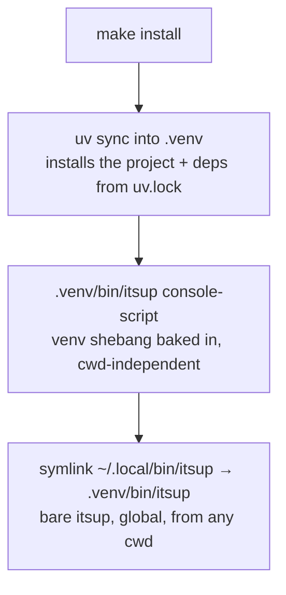

# itsUP CLI Distribution — Design

## Purpose

itsup is invokable as a packaged console-script that always runs with the project
venv and works from any directory. It is exposed globally through a user-PATH
symlink (`~/.local/bin/itsup` → `<repo>/.venv/bin/itsup`), so the bare `itsup` runs
from anywhere on the machine — an agent or operator never has to `cd` into the repo
or source anything to operate on the project's config and secrets. itsUP stays a
single-root tool: the global handle always resolves back to, and operates on, its
own repo.
No runtime caller — systemd units, launchd agents, the API self-update —
sources or activates anything.

This exists because the prior `bin/itsup` (`#!/usr/bin/env python3`) bound the
interpreter to whatever python was active, and read cwd-relative data paths, so
every caller had to activate the venv and stand in the repo root. A single
missed activation produced `ModuleNotFoundError`; a wrong cwd produced empty
project/secret reads. Three separable concerns are resolved independently:
interpreter binding, root resolution, and PATH exposure.

## Inputs/Outputs

**Inputs**

- The repository checkout and its uv-managed `.venv` (the project is installed
  into the repo's own `.venv`, so the package and the data dirs share one tree).
- `ITSUP_ROOT` (optional environment variable) — the install root override.

**Outputs**

- A console-script `<repo>/.venv/bin/itsup`, minted when `uv sync` installs the
  project into `.venv` — runs with the venv interpreter from any cwd with no
  sourcing.
- A user-PATH symlink `~/.local/bin/itsup` → `<repo>/.venv/bin/itsup`, created by
  `make install` — the canonical global invocation: the bare `itsup` from any
  directory.
- For development, run project tools with `uv run` (no activation needed); shell
  completion lives in `bin/itsup-completion.sh` (bash + zsh, self-inits compinit).
  An interactive `make install` prints the completion `source` line to add to a
  shell rc; a non-interactive one (an agent/provisioning) inspects the environment
  and wires it in automatically (into `~/.config/zsh/init.local.zsh` if present,
  else the shell rc). Neither is required to run `itsup`.
- All data access (`projects/`, `secrets/`, `upstream/`, `tpl/`,
  `projects/itsup.yml`, …) resolved beneath `root()`.

**Governing code**

- Entry point: `pyproject.toml` `[project.scripts] itsup = "itsup.cli:main"`.
- Root resolution: `lib/paths.py:root()`.
- Project install via `uv sync` (mints the console-script) + the
  `~/.local/bin/itsup` PATH symlink + `ITSUP_ROOT` wiring: `bin/install.sh`
  (`make install`); host integration lives in `bin/install-bringup.sh`
  (`make install-runtime`).

## Invariants

1. **The interpreter is intrinsic.** `itsup` runs with the venv python because
   the installer bakes the venv interpreter into the console-script shebang when
   `uv sync` installs the project. No `source`/`activate` precedes a correct run.
2. **Root is resolved, never cwd-derived.** `root()` returns
   `ITSUP_ROOT` when set, otherwise derives the repo root from the installed
   package location. Every data path is `root() / "…"`; no module reads a
   cwd-relative `Path("projects"|"secrets"|"upstream"|"tpl")`.
3. **`itsup` is global, but bound to one repo.** `make install` creates a
   user-PATH symlink `~/.local/bin/itsup` → `<repo>/.venv/bin/itsup`, so the bare
   `itsup` is invokable from any directory on the machine without sourcing. The
   symlink target *is* the repo's own console-script — baked venv-python shebang
   (invariant 1) plus the project install into the repo's `.venv` — so invoking it
   runs the repo's interpreter and imports the repo's package. `root()` then
   derives the install root from that package's location (invariant 2), so a global
   call always operates on its own repo, never the cwd. The symlink only puts the
   name on `PATH`; the repo binding comes from the target and package location, not
   the symlink path. This mirrors how `telec` is exposed (a `~/.local/bin` symlink
   into its repo). Runtime callers still use the absolute `<repo>/.venv/bin/itsup`
   directly; humans and agents use the global `itsup`.
4. **Single-root, not cwd/project-aware.** itsup binds to one install root; it
   does not select a project from the current directory the way `telec` does.
   See `project/adr/0001-itsup-cli-single-root`.
5. **No sourcing required, anywhere.** Runtime callers (systemd units, launchd
   agents, the API self-update) invoke the absolute `<repo>/.venv/bin/itsup`
   (or the venv python) with `ITSUP_ROOT` set; interactive users and agents reach
   the bare `itsup` through the global symlink. Developers run project tools via
   `uv run` and opt into completion via `source bin/itsup-completion.sh`.

## Primary flows

### Install (`make install`)

`ITSUP_ROOT` wiring into the systemd/launchd units is installed separately by
`make install-runtime` (host integration), not by `make install`.

### Invocation

`itsup <cmd>` from any cwd → the `~/.local/bin/itsup` symlink → the repo's venv
console-script (right interpreter, repo's package) → `main()` → `root()` resolves
data dirs from `ITSUP_ROOT` or the location of the installed package
(`lib/paths.py`), which the project install (`uv sync`) pins to the repo. cwd and
the symlink path are irrelevant to that derivation; the global `itsup` always
operates on its own repo. Runtime callers invoke the absolute
`<repo>/.venv/bin/itsup` directly.

### Self-update (`_handle_itsup_update`)

`git reset --hard origin/main` → `uv sync --no-dev` (re-mints the console-script on
entry-point changes, installs runtime deps from `uv.lock`, prunes to the lock) →
deploy stacks → `itsup apply` → restart API. Every runtime `itsup` call is the
absolute `<repo>/.venv/bin/itsup` console-script.

## Failure modes

- **`ITSUP_ROOT` unset outside the repo's uv-synced install.** `root()` cannot
  derive a root from a site-packages location → it raises a clear configuration
  error rather than silently reading the wrong tree. The repo's `uv sync` install
  is the supported topology; `ITSUP_ROOT` is the override for anything else.
- **Entry-point or package layout change without re-running `uv sync`.**
  The console-script goes stale. The install step and the self-update both run
  `uv sync` so a code update can never leave `itsup` pointing at a removed module.
- **Console-script missing because `uv sync` never ran.** `itsup` cannot be
  invoked and runtime callers fail. `make install` runs `uv sync` so the
  console-script always exists after install; the API self-update re-mints it.
- **`~/.local/bin` not on `PATH`.** The bare `itsup` is not found from outside the
  repo. The absolute `<repo>/.venv/bin/itsup` always works; `make install` surfaces
  when `~/.local/bin` is absent from `PATH` so the user can add it.

## See Also

- docs/project/adr/0001-itsup-cli-single-root.md
- docs/project/design/deployment-orchestration.md
