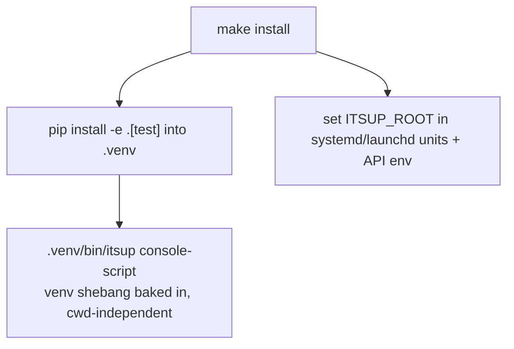

# itsUP CLI Distribution — Design

## Purpose

itsup is invokable as a repo-local console-script that always runs with the project
venv and works from any directory, so no runtime caller — systemd units, the API
self-update, `start-api.sh` — has to `source env.sh` first. itsUP is a single-repo,
single-host tool; it is deliberately NOT installed system-wide.

This exists because the prior `bin/itsup` (`#!/usr/bin/env python3`) bound the
interpreter to whatever python was active, and read cwd-relative data paths, so
every caller had to activate the venv and stand in the repo root. A single
missed activation produced `ModuleNotFoundError`; a wrong cwd produced empty
project/secret reads. Three separable concerns are resolved independently:
interpreter binding, root resolution, and PATH exposure.

## Inputs/Outputs

**Inputs**

- The repository checkout and its `.venv` (the editable install lives in the
  repo, so the package and the data dirs share one tree).
- `ITSUP_ROOT` (optional environment variable) — the install root override.

**Outputs**

- A repo-local console-script `<repo>/.venv/bin/itsup`, minted by the editable
  install — the canonical invocation, runnable from any cwd with no sourcing.
- `source env.sh` remains the interactive shorthand (puts `itsup` on `PATH` for
  the session + shell completion); no global/system install.
- All data access (`projects/`, `secrets/`, `upstream/`, `tpl/`,
  `projects/itsup.yml`, …) resolved beneath `root()`.

**Governing code**

- Entry point: `pyproject.toml` `[project.scripts] itsup = "itsup.cli:main"`.
- Root resolution: `lib/paths.py:root()`.
- Editable install (mints the console-script) + `ITSUP_ROOT` wiring:
  `bin/install.sh` / `bin/install-bringup.sh` (`make install`).

## Invariants

1. **The interpreter is intrinsic.** `itsup` runs with the venv python because
   pip bakes the venv interpreter into the console-script shebang at
   `pip install -e .` time. No `source`/`activate` precedes a correct run.
2. **Root is resolved, never cwd-derived.** `root()` returns
   `ITSUP_ROOT` when set, otherwise derives the repo root from the installed
   package location. Every data path is `root() / "…"`; no module reads a
   cwd-relative `Path("projects"|"secrets"|"upstream"|"tpl")`.
3. **`itsup` is repo-local, not system-wide.** The editable install mints
   `<repo>/.venv/bin/itsup`, the canonical command; it is self-contained and runs
   from any cwd. There is no `/usr/local/bin` symlink — itsUP is not installed
   system-wide. Runtime callers use the absolute `<repo>/.venv/bin/itsup`;
   interactive users get the bare `itsup` shorthand via `source env.sh`.
4. **Single-root, not cwd/project-aware.** itsup binds to one install root; it
   does not select a project from the current directory the way `telec` does.
   See `project/adr/0001-itsup-cli-single-root`.
5. **No runtime sourcing.** systemd units, `start-api.sh`, and the API
   self-update invoke `itsup` (or the venv python) directly with `ITSUP_ROOT`
   in the environment; `env.sh` is a developer convenience only.

## Primary flows

### Install (`make install`)

### Invocation

`<repo>/.venv/bin/itsup <cmd>` from any cwd → the venv console-script (right
interpreter) → `main()` → `root()` resolves data dirs from `ITSUP_ROOT` or the
package location. cwd is irrelevant. Interactively, `source env.sh` lets you type
the bare `itsup` shorthand for the session.

### Self-update (`_handle_itsup_update`)

`git reset --hard origin/main` → `pip install -e .` (re-mints the console-script
on entry-point changes) + `pip install -r requirements-prod.txt` → deploy stacks
→ `itsup apply` → restart API. Every runtime `itsup` call is the absolute
`<repo>/.venv/bin/itsup` console-script.

## Failure modes

- **`ITSUP_ROOT` unset on a non-editable install.** `root()` cannot derive a
  root from a site-packages location → it raises a clear configuration error
  rather than silently reading the wrong tree. The editable install is the
  supported topology; `ITSUP_ROOT` is the override for anything else.
- **Entry-point or package layout change without re-running `pip install -e .`.**
  The console-script goes stale. The install step and the self-update both run
  the editable install so a code update can never leave `itsup` pointing at a
  removed module.
- **Console-script missing because the editable install never ran.** `itsup`
  cannot be invoked and runtime callers fail. `make install` runs `pip install -e .`
  so the console-script always exists after install; the API self-update re-mints it.
- **A caller still sourcing `env.sh` and relying on cwd.** Tolerated but
  unnecessary; the runtime path no longer depends on it.

## See Also

- docs/project/adr/0001-itsup-cli-single-root.md
- docs/project/design/deployment-orchestration.md
