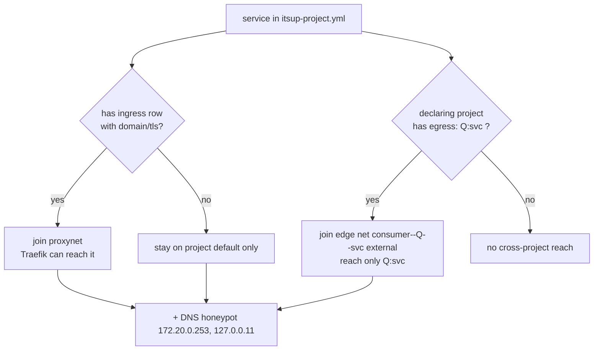

# Network Segmentation — Design

## Purpose

itsUP defaults every upstream service to **project-local isolation** and grants
cross-project or external reachability only where a config declaration earns it.
The goal is a default-deny posture between projects: a compromised container can
reach only the specific provider services its project explicitly declared — not
the provider's other services, not other consumers of that service, and not every
container on a shared bridge.

This exists because the naive layout — putting all upstream services on one
shared `proxynet` bridge — lets any compromised container resolve and attack any
other service in any other project (lateral movement). Segmentation replaces that
flat network with three explicit states, driven entirely by each project's
`itsup-project.yml`.

The mechanism is **generation-time network assignment**, not a runtime firewall:
`bin/write_artifacts.py` writes the per-service `networks:` blocks into the
generated `upstream/{project}/docker-compose.yml`, and Docker enforces
reachability by network membership. (OpenSnitch + iptables, documented in
`docs/security.md`, are a separate, complementary runtime layer.)

## Inputs/Outputs

**Inputs**

- `projects/{project}/itsup-project.yml` (or legacy `ingress.yml`):
  - `ingress:` — list of `Ingress` rows (`lib/models.py`). A row with a `domain`
    or `tls` produces Traefik labels.
  - `egress:` — list of `project:service` strings (e.g. `internal-api:app`). Each
    entry names a single provider service; the join is scoped to that service.
- `projects/{project}/docker-compose.yml` — the service definitions.

**Outputs**

- `upstream/{project}/docker-compose.yml` with, per service, a `networks:` block,
  and a top-level `networks:` map declaring `proxynet` and the per-edge egress
  networks. On the **consumer** side each edge network is declared `external: true`;
  on the **provider** side it is declared with an explicit Docker `name:` and
  attached only to the named service.

**Governing code**

- Network assignment: `bin/write_artifacts.py:write_upstream()` (Phase 1 proxynet
  + DNS, Phase 2 consumer-side edge joins, Phase 2b provider-side edge creation,
  Phase 3 static-IP pinning). `write_upstreams()` builds the reverse egress graph
  once and passes it to each `write_upstream()` call.
- Edge-network naming: `lib/data.py:edge_network_name()`.
- Reverse egress graph (provider → its consumers): `lib/data.py:build_reverse_egress_graph()`.
- Egress validation: `lib/data.py:_validate_egress_targets()`.
- Deploy ordering: `lib/data.py:list_projects_topo()`.

## Invariants

1. **proxynet membership is ingress-gated.** A service joins the shared
   `proxynet` bridge **iff** it carries Traefik labels (i.e. an ingress row with
   `domain`/`tls`). No ingress ⇒ no proxynet. Source: the `has_traefik` guard in
   `write_upstream()` Phase 1. proxynet is `external` (created by the DNS stack,
   subnet `172.20.0.0/16`; `.1` gateway and `.253` honeypot are reserved —
   `lib/data.py:PROXYNET_RESERVED_IPS`).

2. **No declaration ⇒ isolation.** A service with neither an ingress row nor a
   project egress declaration stays only on its project-local `default` network.
   It is reachable by its own project's services and nothing else.

3. **Egress is per-edge and least-privilege.** Declaring `egress: [Q:svc]` joins
   the declaring project's services to a dedicated network shared only with Q's
   `svc` — named `{consumer}--Q--svc` (`edge_network_name()`, falling back to
   `egress-{sha256[:12]}` when the natural name exceeds 64 chars). The consumer
   reaches **only** `Q:svc` — not Q's other services, and not other consumers of
   `Q:svc` (each consumer is on its own edge network). Q's project-local
   `{Q}_default` is never joined by the consumer. Multiple egress entries to the
   same provider produce separate per-service edge networks.

4. **The provider attaches only the named service.** On the provider side
   (Phase 2b) itsUP creates each edge network with an explicit Docker `name:` (so
   the consumer can reference it as `external` without the compose project prefix)
   and attaches **only** the named service to it. Q's other services stay on
   `{Q}_default` and are unreachable across the edge.

5. **Egress targets are validated to exist.** `_validate_egress_targets()`
   rejects a malformed string (no `:`), a missing target project, or a target
   service absent from the target project's compose (matched as either `svc` or
   `{Q}-{svc}`). Validation runs in `validate_all()` before any artifact write.

6. **Deploy order is egress-topological.** Project `P` with `egress: [Q:...]`
   joins a per-edge network **created by Q** (declared in Q's generated compose),
   so Q must already be up or `docker compose up` for P fails with the edge
   network declared as `external` but not found. `list_projects_topo()` returns a
   Kahn topological order (alphabetical tie-break); a dependency cycle falls back
   to alphabetical order with a warning (the cycle is surfaced as a config error
   by `validate_all`, not crashed on here).

## Primary flows

### Network assignment (during `itsup apply` / `bin/write_artifacts.py`)

1. **Phase 1 — ingress + DNS.** Services with Traefik labels join `proxynet`.
   Every service gets the DNS honeypot (`172.20.0.253`) plus Docker DNS
   (`127.0.0.11`) injected unless an ingress row pins explicit `dns`.
2. **Phase 2 — consumer-side egress.** For each `Q:svc` egress string, the
   consumer declares the edge network `{consumer}--Q--svc` as `external: true` and
   joins all of its own services to it. No `{Q}_default` join occurs.
3. **Phase 2b — provider-side egress.** For each consumer declared against this
   project (from `build_reverse_egress_graph()`), itsUP creates the edge network
   with an explicit Docker `name:` and attaches **only** the named provider
   service to it.
4. **Phase 3 — static proxynet IP pinning.** When an ingress row sets
   `ipv4_address`, that service's `networks:` is rewritten to mapping form to pin
   the IP on `proxynet`.

### Cross-project access (operator's mental model)

To let project `A` call service `svc` in project `B`, add `egress: [B:svc]` to
`A/itsup-project.yml`. A's services then resolve and reach **only** `B:svc` over
the dedicated `A--B--svc` edge network — not B's other services and not other
consumers of `B:svc`. Without that declaration the call fails at DNS (the honeypot
logs the `NXDOMAIN`).

## Failure modes

- **Egress to a non-existent project/service.** `validate_all()` reports the
  error and the apply aborts before writing artifacts. The fix is to correct the
  `project:service` string or deploy the target.
- **Egress dependency cycle (A→B, B→A).** `list_projects_topo()` warns and falls
  back to alphabetical order; the first-deployed project's external edge network
  may not exist yet, so its `docker compose up` fails with `network <edge>
  declared as external, but could not be found`. Break the cycle in config.
- **Expecting reach beyond the declared edge.** A consumer that assumes it can
  reach the provider's *other* services, or another consumer of the same service,
  will fail at name resolution — this is the designed least-privilege boundary
  (Invariants 3–4). Add an explicit `egress: [B:other-svc]` for each provider
  service actually needed.
- **Expecting external access without ingress.** A service with no ingress row
  never joins proxynet, so Traefik cannot route to it regardless of its
  `docker-compose.yml` ports. Add an ingress row with a `domain`/`tls` to expose
  it.

## See Also

- docs/networking.md
- docs/security.md
- docs/architecture.md
