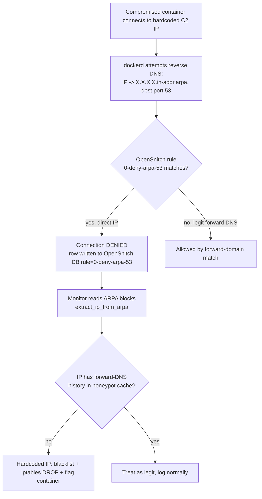

# Security Architecture — Design

## Purpose

itsUP runs 20+ third-party containerized services on a single Docker host. The
core threat is therefore **a compromised upstream container** — a backdoored
dependency, supply-chain implant, or exploited service — and what it can reach
once inside: other tenants' services (lateral movement) and the outside world
(data/credential exfiltration). A real incident drove this posture: a container
was exfiltrating OpenAI API keys in real time to a hardcoded-IP C2 server, and
key rotation only bought minutes (`docs/security.md`).

The design answer is **defense in depth**: no single control is trusted to hold.
Six layers compose, each closing a gap the others leave open:

1. **Network segmentation** — default-deny reachability between projects so a
   compromised container cannot move laterally (`docs/project/design/network-segmentation.md`).
2. **Egress control via reverse-DNS block** — the `0-deny-arpa-53` OpenSnitch
   rule that drops direct-IP outbound connections while leaving DNS-resolved
   traffic intact (the decision is recorded in `docs/project/adr/0002-block-reverse-dns-egress.md`).
3. **Container-security monitor** — a correlation engine that turns OpenSnitch
   blocks into auto-blacklisted IPs and flags the connecting container
   (`docs/project/design/container-security-monitor.md`).
4. **DNS honeypot** — a logging dnsmasq instance that records every forward DNS
   query, providing the "did anyone resolve this IP?" oracle the monitor needs.
5. **Secrets at rest** — SOPS/age encryption with per-context, non-merged
   loading, so a compromised project never sees infra or sibling secrets
   (`docs/project/spec/secrets-management.md`).
6. **API authentication and exposure** — the deploy webhook surface is
   apikey-guarded and carries no public route; the internet-facing router matches
   only the `/redirect` path prefix, under which `GET /redirect` is the sole
   endpoint served (`docs/project/spec/api-surface.md`).

This snippet is the overview and threat model only; each layer's mechanism lives
in its own snippet. It restates a layer only where the **interaction between
layers** is the load-bearing fact.

## Inputs/Outputs

**Inputs (the security posture consumes)**

- Per-project `itsup-project.yml` `ingress`/`egress` declarations (drives the
  network-segmentation layer).
- The OpenSnitch rule `opensnitch/0-deny-arpa-53.json` and its SQLite
  `connections` table (drives the egress + monitor layers).
- DNS honeypot forward-query logs (`172.20.0.253`, `dns/docker-compose.yml`).
- Encrypted secret files under `secrets/` and the age key (`secrets/.sops.yaml`).
- The `API_KEY` infra secret (`lib/auth.py`).

**Outputs (the posture produces)**

- Docker network membership enforcing project isolation (generated
  `upstream/{project}/docker-compose.yml`).
- A live iptables DROP set of blacklisted C2 IPs and an in-memory validation set
  of OpenSnitch-blocked IPs (`monitor/core.py`, `monitor/opensnitch.py`).
- A compromise signal naming the connecting container when a hardcoded-IP
  connection is observed.

**Governing code**

- Egress block rule: `opensnitch/0-deny-arpa-53.json`.
- Block ingestion + correlation: `monitor/core.py`, `monitor/opensnitch.py`,
  entrypoint `bin/monitor.py`.
- Segmentation: `bin/write_artifacts.py`, `lib/data.py`.
- Secrets: `lib/sops.py`, `lib/data.py`.
- API auth: `lib/auth.py`.

## Invariants

The guarantees the architecture is built to keep — each is one layer's load-bearing
promise.

1. **Default-deny between projects.** A service with neither an ingress row nor an
   egress declaration is reachable only by its own project; cross-project reach is
   per-edge and least-privilege. Lateral movement is the exception, not the
   default. (Network-segmentation Invariants 2–4.)

2. **Fail-closed egress to hardcoded IPs.** A container connecting to a raw IP
   that no container resolved via DNS triggers OpenSnitch's reverse-DNS lookup,
   matches `0-deny-arpa-53` (process `=/usr/bin/dockerd`, dest port `53`, dest
   host regexp `^(\d{1,3}\.){4}in-addr\.arpa$`), and the connection is **denied**.
   DNS-resolved traffic matches by forward domain and is unaffected. The block is
   the default action for direct-IP egress, so a *new*, unseen C2 IP is dropped
   before the monitor has ever heard of it.

3. **DNS-history is the trust oracle.** An outbound IP is trusted iff some
   container performed a forward DNS lookup for it (honeypot-logged); the monitor
   keeps that cache for the session and treats no-DNS-history as malware/VPN
   (`monitor/core.py` `_handle_hardcoded_ip_detection`). Trust is earned by
   resolution, not by reputation.

4. **Secrets never cross context.** `load_secrets(None)` loads only infra
   secrets; `load_secrets(project)` loads only that project's file — a compromised
   project container's env contains its own secrets and nothing else. Encrypted
   `.enc.txt` is preferred and decrypted to memory only. (Secrets-management spec.)

5. **Mutating API calls are apikey-gated and unrouted from the internet.** Every
   deploy/webhook endpoint depends on `verify_apikey`; an absent key returns 503,
   a wrong key 401. The key is a deploy credential. The proxy additionally routes
   none of these endpoints publicly, so reaching them at all requires a position
   on the host, the LAN, or the VPN — the API key alone is not a remote deploy
   credential. (API-surface spec.)

## Primary flows

### How an exfiltration attempt is detected and blocked

1. **Connect.** A compromised container opens an outbound TCP connection to a
   hardcoded C2 IP (skipping DNS to avoid the honeypot).
2. **Reverse lookup.** dockerd performs a reverse-DNS lookup on that IP
   (`X.X.X.X.in-addr.arpa`, dest port 53) as part of connection handling.
3. **Block.** OpenSnitch matches `0-deny-arpa-53` and denies the lookup; because
   the direct-IP path depends on that lookup, the C2 connection does not complete.
   The deny is recorded in the OpenSnitch SQLite `connections` table with
   `rule = '0-deny-arpa-53'` and `dst_host` = the in-addr.arpa name.
4. **Correlate.** The monitor polls those blocks (`monitor/opensnitch.py`),
   extracts the IP, and — via `check_direct_connections` /
   `_handle_hardcoded_ip_detection` in `monitor/core.py` — checks the honeypot DNS
   cache. An IP with **no** forward-DNS history is a hardcoded-IP connection.
5. **Blacklist + attribute.** The monitor adds an iptables DROP for the IP and
   surfaces the connecting container as compromised. Observed steady-state:
   ~5–10 new IPs auto-blacklisted per day (`docs/security.md`).

### How a lateral-movement attempt is contained

A compromised container tries to reach a sibling project's service. Because the
two share no Docker network unless an `egress: [project:service]` edge was
declared, name resolution fails at the honeypot (logged `NXDOMAIN`) and no
connection forms. See `docs/project/design/network-segmentation.md`.

## Failure modes

Each layer has a defeat condition; depth exists because no single layer is
complete.

- **Egress block — DNS-resolving malware defeats it.** The block stops *direct-IP*
  egress only. Malware that first does a forward DNS lookup for an attacker domain
  resolves to an IP, gains DNS history, and is treated as legitimate. The honeypot
  logs the domain, but blocking it is not automatic. (This is the deliberate
  trade-off in ADR 0002.)
- **Egress block — depends on OpenSnitch's reverse-DNS-on-connect behavior.** If
  OpenSnitch is not installed, or a future version stops performing reverse DNS on
  direct-IP connections, the fail-closed property is lost; the monitor then falls
  back to iptables/journalctl + honeypot correlation, which needs more validation
  (`docs/security.md`).
- **Monitor — trust-on-first-DNS.** The DNS cache trusts an IP forever once any
  container resolves it (until monitor restart); malware that piggybacks on a
  domain a legitimate service already resolved would inherit that trust.
- **Network segmentation — over-broad egress declaration.** Segmentation is only
  as tight as the declared edges; a project that declares egress to a service it
  does not need widens the reachable surface for its own compromise.
- **Secrets — plaintext fallback.** A `.txt` file shadowing a missing `.enc.txt`
  is loaded (with a production warning) — encryption at rest is lost if operators
  leave plaintext in place.
- **API auth — single shared key, network-bounded.** One `API_KEY` guards all
  deploy endpoints, and webhook deploys are `GET`s with side effects. A leaked key
  is a full deploy credential to anyone already on the host, the LAN, or the VPN;
  from the internet it reaches no deploy endpoint, because none is routed. The
  residual is therefore an insider or a client that has already crossed the
  network boundary, not an anonymous remote caller.
- **Unresolved residual.** The originally compromised container was never
  positively identified; the architecture *contains* the exfiltration rather than
  removing the implant. The threat is assumed still present.

## See Also

- docs/project/design/network-segmentation.md
- docs/project/design/container-security-monitor.md
- docs/project/adr/0002-block-reverse-dns-egress.md
- docs/project/spec/secrets-management.md
- docs/project/spec/api-surface.md
