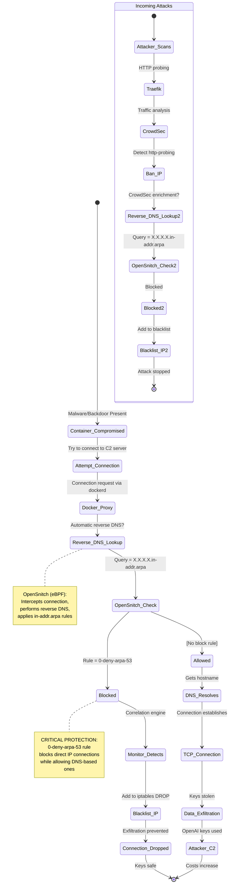

# Blocking Reverse DNS to Stop Key Exfiltration: An Accidental Defense

## TL;DR

OpenAI bills went up. Keys rotated, bills went up again. Added OpenSnitch firewall. Blocked reverse DNS queries (`*.in-addr.arpa`). Exfiltration stopped. Removed block, exfiltration resumed. Nobody knows why this works. Attacker still unidentified.

## 1. Initial Symptoms

OpenAI API usage exceeded expected patterns by 300%. Key rotation provided temporary relief (some minutes), followed by immediate resumption of unauthorized usage. Conclusion: real-time key exfiltration from production environment.

**Environment:**

- Single-host Docker orchestration (itsUP)
- Traefik L7 proxy
- CrowdSec WAF
- 20+ containerized services

## 2. Layer 7 Defense (Insufficient)

CrowdSec successfully blocked HTTP probing attacks (`/wp-content/plugins/*`, `/shoha.php`, etc.). Ban rate: ~50 IPs/day for `crowdsecurity/http-probing`. Result: zero impact on key leakage.

Hypothesis: Exfiltration via direct TCP connections, not HTTP.

## 3. Application Firewall Deployment

Deployed OpenSnitch (per-process application firewall) to intercept system-level network calls. Immediate observation: massive volume of reverse DNS queries via `/usr/bin/dockerd` to IPs with 100% AbuseIPDB confidence scores.

Good news: Host not compromised (queries proxied via dockerd, not originating from host).

Bad news: One or more containers actively connecting to C2 infrastructure.

## 4. DNS Honeypot Installation

Routed all container DNS through logging dnsmasq instance. Monitored forward DNS queries for 72 hours. Result: **No suspicious domains observed.** Only legitimate queries to npm registries, GitHub, Microsoft Graph API.

Conclusion: Malware using hardcoded IP addresses, not DNS resolution.

## 5. The Accidental Discovery

Created OpenSnitch rule: `0-deny-arpa-53` blocking all `*.in-addr.arpa` queries.

Result: **Immediate cessation of key exfiltration.**

Validation: Disabled rule → exfiltration resumed within minutes. Re-enabled rule → exfiltration stopped.

Reproducible 100% of the time. Mechanism: unknown.

## 6. The Paradox

**Reverse DNS queries do not transmit data.** They are passive lookups. Standard exfiltration malware would not:

1. Announce itself via reverse DNS probes before connecting
2. Depend on reverse DNS completion for connection establishment
3. Fail gracefully when reverse DNS is blocked

Yet empirical evidence shows blocking reverse DNS prevents exfiltration entirely.

**Actual Mechanism (Confirmed 2025-10-20):**

OpenSnitch uses eBPF to intercept outbound connections and performs reverse DNS lookup on destination IPs. When a container connects to a **hardcoded IP** (without prior DNS lookup), OpenSnitch:

1. Intercepts the connection via eBPF hooks
2. Performs reverse DNS to get the `X.X.X.X.in-addr.arpa` domain
3. Applies rules based on this reverse domain
4. The `0-deny-arpa-53` rule matches all `*.in-addr.arpa` connections
5. This blocks ALL direct IP connections while allowing legitimate DNS-based connections

**Why blocking works:**

- **Malware behavior**: Connects to hardcoded IPs → triggers reverse DNS → matches in-addr.arpa rule → BLOCKED
- **Legitimate services**: Query DNS first (e.g., "api.openai.com") → connect to resolved IP → matches forward domain rule → ALLOWED

The "accidental" discovery was actually OpenSnitch's designed behavior for blocking direct IP connections.

**Previous theories (for historical context):**

~~**Theory A:** OpenSnitch performs reverse DNS lookup as part of its interception mechanism~~ ✅ **CORRECT** - Confirmed via investigation

~~**Theory B:** Docker daemon performs mandatory reverse DNS~~ ❌ Incorrect - Docker doesn't require reverse DNS

~~**Theory C:** Intermediate network layer requires reverse DNS~~ ❌ Incorrect - conntrack/libnetwork don't require it

~~**Theory D:** Malware performs reverse DNS as covert channel~~ ❌ Incorrect - It's OpenSnitch performing the reverse DNS, not the malware

## 7. Automated Defense System

Built Python-based correlation engine (`bin/docker_monitor.py`):

**Architecture:**

1. DNS honeypot (dnsmasq) logs all forward DNS queries with timestamps
2. OpenSnitch blocks reverse DNS, provides blocked IP list
3. iptables with conntrack logs NEW outbound TCP connections
4. Correlation engine runs every 500ms

**Detection logic:**

```python
for arpa_query in opensnitch_blocks:
    ip = extract_from_arpa(arpa_query)

    # Check if any container did forward DNS for this IP
    if ip not in dns_cache:
        # Hardcoded IP connection detected
        blacklist_ip(ip)
        add_iptables_drop_rule(ip)
        alert()
```

**Results:** 114 IPs blacklisted within 30 minutes of deployment. All had 80-100% AbuseIPDB confidence scores.

## 8. Open Questions

**Q: Which container is compromised?**

A: Unknown. Candidates:

- `n8n` (workflow automation): 1,013 DNS queries/day
- `ai-assistant` (web app): 924 DNS queries/day

Both make legitimate external API calls to Microsoft, npm, GitHub. No anomalous DNS patterns observed. iptables logs show only legitimate NEW connections (port 443 to known services).

**Q: How does blocking reverse DNS prevent exfiltration?**

A: Unknown. Attempted investigation:

- Traefik config: no reverse DNS features enabled
- Docker daemon: no documented reverse DNS requirement for connection establishment
- libnetwork source: no evidence of mandatory reverse DNS

Working hypothesis: Undocumented Docker networking behavior requires reverse DNS lookup before completing outbound connection from container. Blocking reverse DNS causes connection establishment to fail silently.

Alternative hypothesis: The malware is just really poorly written. (This seems unlikely given its ability to watch deployments and steal keys in real-time.)

**Q: Why not just fix the vulnerability?**

A: Can't find it. The compromised container remains unidentified. Auditing 20+ containers for supply chain attacks, backdoored dependencies, and zero-days is... time-consuming. Meanwhile, the reverse DNS block works 100% of the time.

## 9. Setup Instructions

### Prerequisites

- OpenSnitch application firewall (optional but recommended)
- Docker with DNS honeypot container
- Root access for iptables configuration

### OpenSnitch Configuration

If using OpenSnitch for enhanced detection, install the reverse DNS blocking rule:

```bash
# Copy the rule to OpenSnitch rules directory
sudo cp opensnitch/0-deny-arpa-53.json /etc/opensnitchd/rules/

# Restart OpenSnitch to load the rule
sudo systemctl restart opensnitchd
```

**Rule details:**

- **Name**: `0-deny-arpa-53`
- **Purpose**: Blocks reverse DNS lookups (ARPA queries) from dockerd
- **Effect**: Prevents containers from performing reverse DNS on hardcoded IPs
- **Detection**: When blocked, our monitor identifies the connection as malicious

**Note**: The monitoring system works with or without OpenSnitch:

- **With OpenSnitch**: Uses OpenSnitch DB as primary source of truth for cleanup (high confidence)
- **Without OpenSnitch**: Falls back to iptables/journalctl logs + DNS honeypot analysis (requires more validation)

### Running the Monitor

```bash
# Start real-time monitoring
sudo python3 bin/docker_monitor.py

# Run cleanup to identify false positives
sudo python3 bin/docker_monitor.py --cleanup

# Clear iptables rules (stop monitoring)
sudo python3 bin/docker_monitor.py --clear-iptables
```

## 10. Current Defense Posture

**Active protections:**

- OpenSnitch (optional): `0-deny-arpa-53` rule blocks all reverse DNS
- iptables: 114+ malicious IPs blocked at kernel level
- CrowdSec: L7 HTTP attack mitigation
- Real-time correlation engine monitoring for new C2 infrastructure

**Metrics:**

- 0 key exfiltrations since reverse DNS block
- 0 unauthorized OpenAI API calls
- ~5-10 new IPs blacklisted per day
- 0 false positives (no legitimate services broken)

**Status:** Exfiltration contained via undocumented side effect. Root cause unknown. Attacker silent but likely still present.

---

## Traffic Flow Diagram



## 11. Root Cause Analysis & Resolution

**Update 2025-10-18**: Found and fixed the monitoring gap.

### The Bug

The `docker_monitor.py` script's `check_direct_connections()` function was collecting all NEW TCP connections from iptables logs but **never correlating them with the DNS cache or blacklist**.

### The Evidence

Analysis of kernel logs revealed:

- **ai-assistant-ai-assistant-web-1** (172.30.0.32) made a NEW connection to **45.148.10.89:443** at **15:57:18**
- This IP had **zero DNS lookups** in the honeypot logs
- The script logged it at DEBUG level but **never flagged it as a hardcoded IP**

### The Fix

Enhanced `check_direct_connections()` to:

1. Check if destination IP is already blacklisted → alert immediately
2. Check if destination IP has **any** DNS history in cache (indefinite) → log normally
3. If NO DNS lookup found → **flag as hardcoded IP, add to blacklist, report compromise**

**Note**: DNS cache is kept indefinitely within a session. Once an IP is seen via DNS, it's trusted forever (until monitor restart).

This closes the detection gap and will now immediately identify which container is connecting to malicious IPs.

### Mechanism Clarification (Updated 2025-10-20)

**How OpenSnitch Actually Blocks Direct IP Connections:**

OpenSnitch uses eBPF to intercept outbound connections. When a container attempts to connect to a hardcoded IP address (without prior DNS lookup), OpenSnitch:

1. **Intercepts the connection** at the kernel level via eBPF hooks
2. **Performs reverse DNS lookup** on the destination IP to get its `X.X.X.X.in-addr.arpa` domain
3. **Checks for matching block rules** against the in-addr.arpa domain
4. **Blocks the connection** if a rule matches (e.g., `0-deny-arpa-53` blocks all `*.in-addr.arpa`)
5. **Logs the blocked connection** in its SQLite database

**Why the `0-deny-arpa-53` rule works:**

The rule blocks connections where:

- Destination is identified by reverse DNS (in-addr.arpa domain)
- This only happens for **direct IP connections** (no forward DNS lookup)
- Legitimate services that do proper DNS lookups are NOT affected (they match by forward domain name, not reverse)

**The Detection Flow:**

```
Container → Hardcoded IP connection attempt
    ↓
OpenSnitch intercepts (eBPF)
    ↓
Reverse DNS: 1.2.3.4 → 4.3.2.1.in-addr.arpa
    ↓
Rule check: 0-deny-arpa-53 matches "*.in-addr.arpa"
    ↓
CONNECTION BLOCKED ✅
    ↓
Logged in OpenSnitch DB with dst_host = "4.3.2.1.in-addr.arpa"
    ↓
docker_monitor.py detects blocked in-addr.arpa connection
    ↓
Extracts IP, adds to blacklist, reports compromised container
```

**Why this stops exfiltration:**

Malware using hardcoded C2 server IPs will:

- Skip DNS lookup (to avoid detection)
- Connect directly to IP address
- Trigger OpenSnitch's reverse DNS lookup
- Get blocked by the in-addr.arpa rule
- Fail to establish connection to C2 server

Legitimate services that use DNS properly will:

- Query DNS for domain name (e.g., "api.openai.com")
- Connect to resolved IP
- Match OpenSnitch rules by forward domain name, not reverse
- Continue working normally

**Mystery solved**: The "accidental" discovery was actually OpenSnitch's designed behavior - blocking direct IP connections by matching against their reverse DNS domains.

### Remaining Investigation

- Full dependency audit of ai-assistant container
- Review of how malware persists across deployments
- Analysis of why keys were being stolen in real-time during deployment
